```{=html}
<style>#title-block-header { display: none !important; }</style>

<!-- ══════════════════════════════════════════════════════
     HERO SECTION
     ══════════════════════════════════════════════════════ -->
<section class="nature-hero-section">
  <div class="nature-hero-container">
    <div class="nature-hero-content">
      <div class="nature-hero-badge">Catálogo Editorial · UNGRD</div>
      <h1 class="nature-hero-title">Subdirección para el Conocimiento del Riesgo</h1>
      <p class="nature-hero-description">
        Los desastres no son naturales: son el resultado de la interacción entre las
        amenazas, las condiciones de vulnerabilidad y la forma en que habitamos y
        transformamos nuestros territorios. Este catálogo reúne las publicaciones,
        guías, informes y materiales de divulgación desarrollados por la Subdirección
        para el Conocimiento del Riesgo, organizados en cuatro grandes líneas temáticas
        del proceso de gestión del riesgo de desastres en Colombia.
      </p>
      <div class="nature-hero-stats">
        <div class="stat-item">
          <span class="stat-num">59</span>
          <span class="stat-label">Publicaciones y recursos</span>
        </div>
        <div class="stat-item">
          <span class="stat-num">4</span>
          <span class="stat-label">Líneas temáticas</span>
        </div>
      </div>
    </div>

    <div class="nature-hero-visual">
      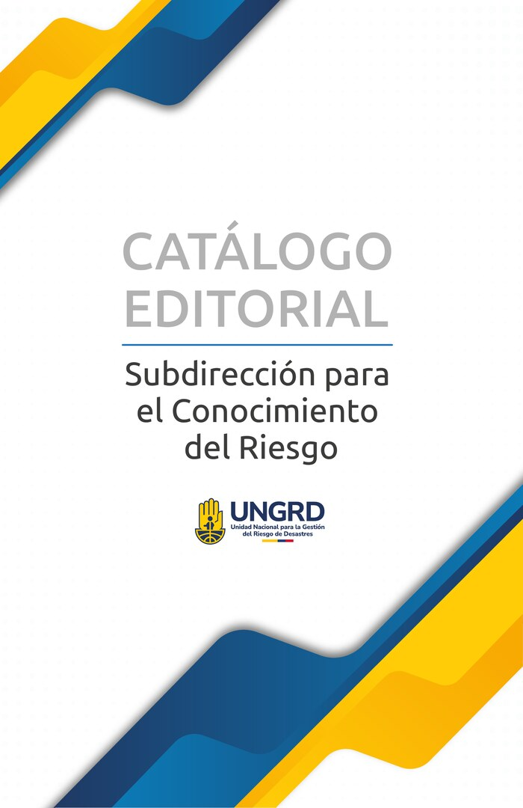
    </div>
  </div>
</section>

<!-- ══════════════════════════════════════════════════════
     1. IDENTIFICACIÓN Y CARACTERIZACIÓN DE ESCENARIOS DE RIESGO
     ══════════════════════════════════════════════════════ -->
<section id="identificacion" class="chapters-section topic-1">
  <div class="chapters-container">
    <div class="section-header">
      <span class="section-eyebrow">Línea temática 1</span>
      <h2 class="section-title">Identificación y caracterización de escenarios de riesgo</h2>
      <div class="section-divider"></div>
      <p class="section-desc">
        Publicaciones que permiten reconocer las amenazas, las condiciones de
        vulnerabilidad y los elementos expuestos presentes en un territorio. Ofrecen
        las bases para comprender cómo se configuran los escenarios de riesgo y
        orientar acciones de planificación, prevención y gestión.
      </p>
    </div>

    <div class="chapters-grid">
      <div class="chapter-card">
        <div class="chapter-card-image">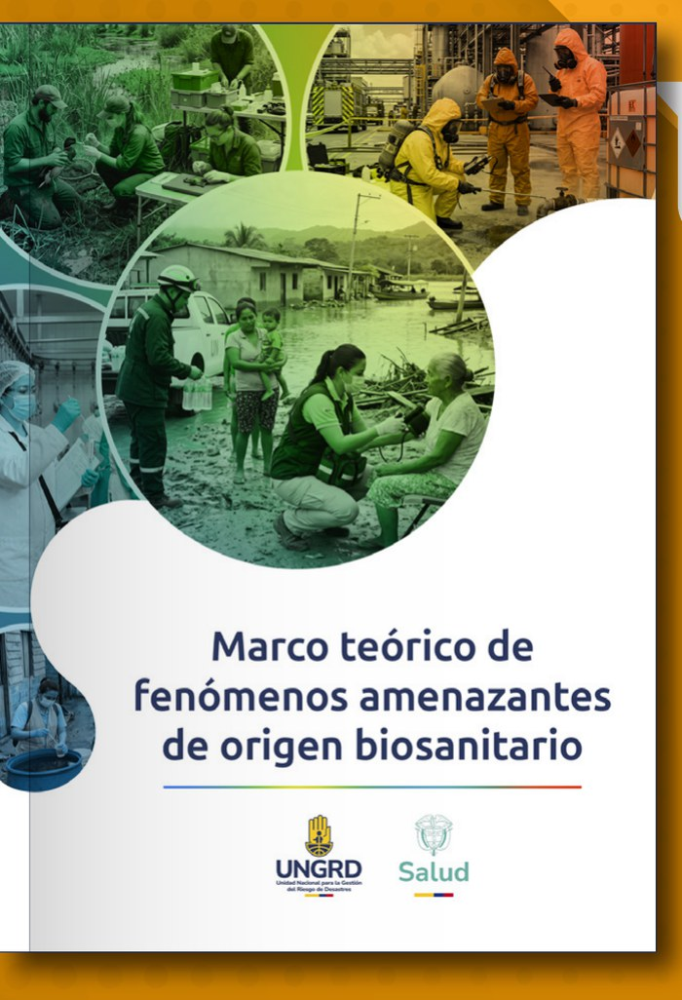</div>
        <div class="chapter-card-content">
          <span class="chapter-tag">Catálogo · Pág. 3</span>
          <h4 class="chapter-title">Marco teórico de fenómenos amenazantes de origen biosanitario</h4>
        </div>
      </div>

      <div class="chapter-card">
        <div class="chapter-card-image">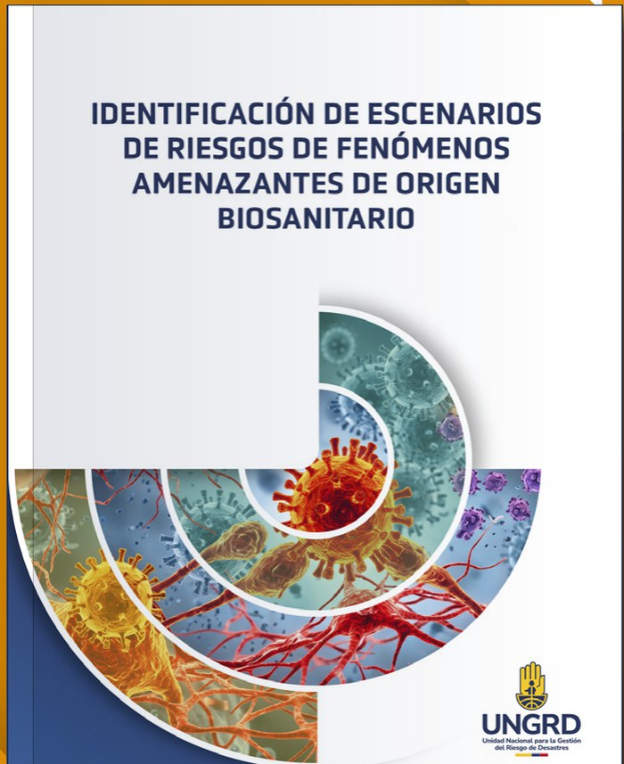</div>
        <div class="chapter-card-content">
          <span class="chapter-tag">Catálogo · Pág. 3</span>
          <h4 class="chapter-title">Identificación de escenarios de riesgos de fenómenos amenazantes de origen biosanitario</h4>
        </div>
      </div>

      <div class="chapter-card">
        <div class="chapter-card-image">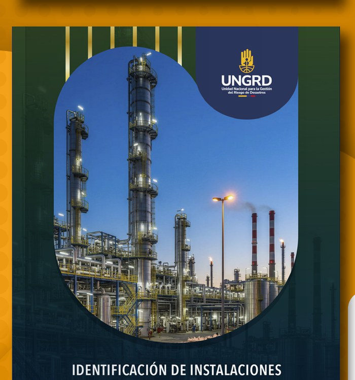</div>
        <div class="chapter-card-content">
          <span class="chapter-tag">Catálogo · Pág. 3</span>
          <h4 class="chapter-title">Identificación de instalaciones industriales como insumo para la identificación de escenarios de riesgo tecnológico y Natech</h4>
        </div>
      </div>

      <div class="chapter-card">
        <div class="chapter-card-image">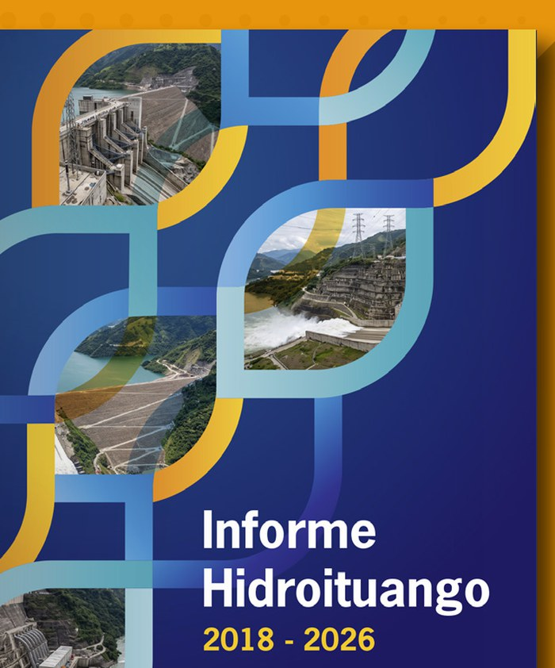</div>
        <div class="chapter-card-content">
          <span class="chapter-tag">Catálogo · Pág. 4</span>
          <h4 class="chapter-title">Informe Hidroituango 2018–2026</h4>
        </div>
      </div>

      <div class="chapter-card">
        <div class="chapter-card-image">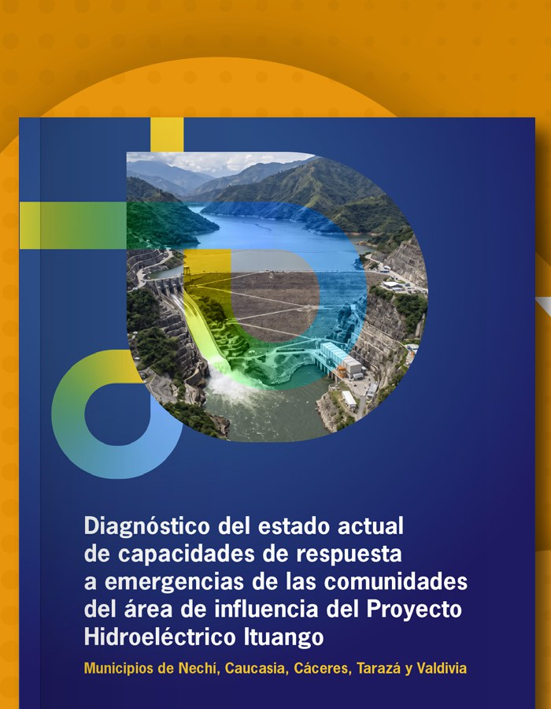</div>
        <div class="chapter-card-content">
          <span class="chapter-tag">Catálogo · Pág. 4</span>
          <h4 class="chapter-title">Diagnóstico de capacidades de GRD de municipios del área de influencia del proyecto hidroeléctrico Ituango</h4>
        </div>
      </div>

      <div class="chapter-card">
        <div class="chapter-card-image">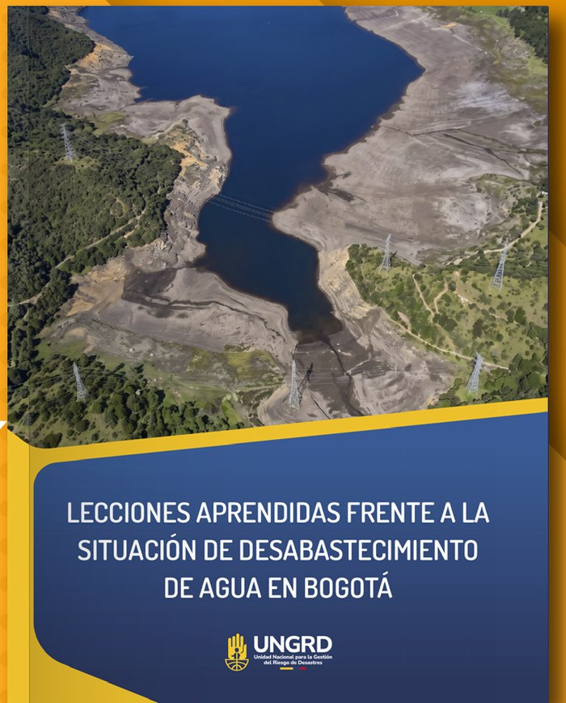</div>
        <div class="chapter-card-content">
          <span class="chapter-tag">Catálogo · Pág. 4</span>
          <h4 class="chapter-title">Lecciones aprendidas frente a la situación de desabastecimiento de agua en Bogotá</h4>
        </div>
      </div>

      <div class="chapter-card">
        <div class="chapter-card-image">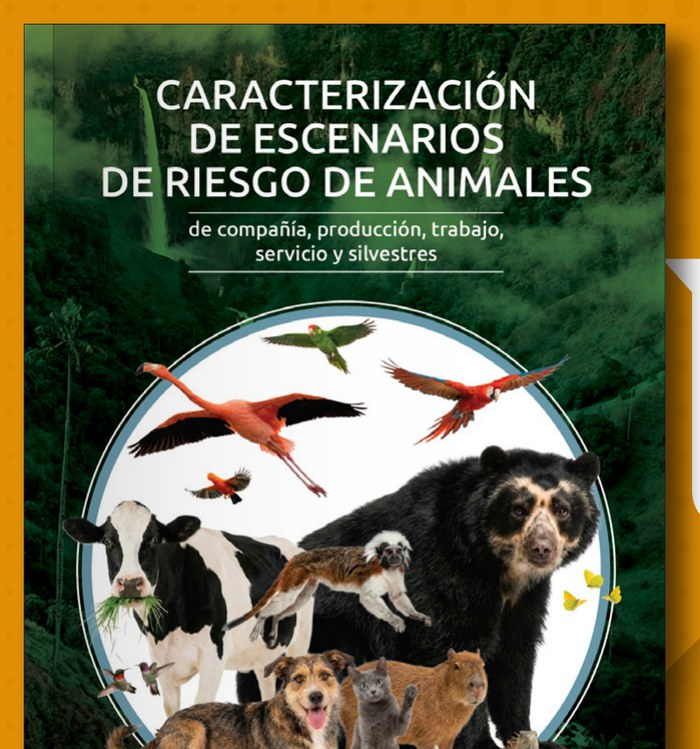</div>
        <div class="chapter-card-content">
          <span class="chapter-tag">Catálogo · Pág. 5</span>
          <h4 class="chapter-title">Caracterización de escenarios de riesgo de animales domésticos de compañía, producción, trabajo, servicio y fauna silvestre</h4>
        </div>
      </div>

      <div class="chapter-card">
        <div class="chapter-card-image">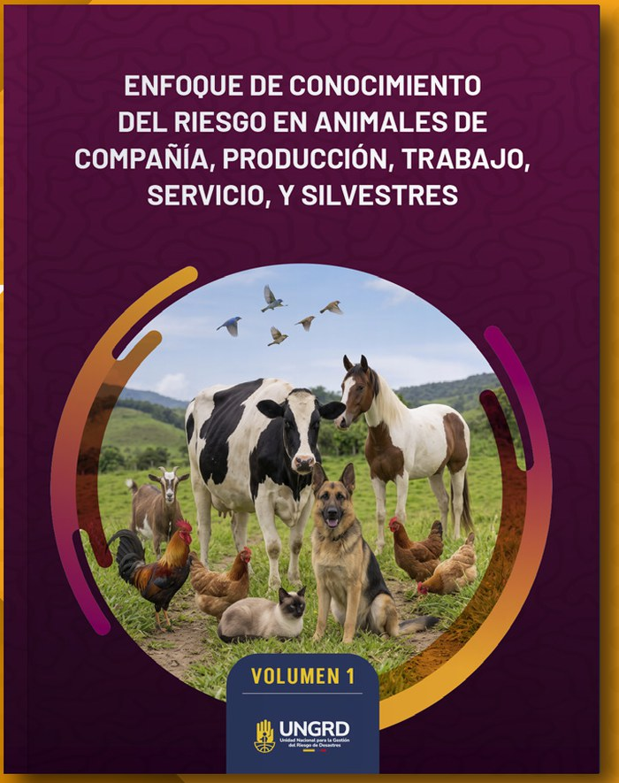</div>
        <div class="chapter-card-content">
          <span class="chapter-tag">Catálogo · Pág. 5</span>
          <h4 class="chapter-title">Enfoque de conocimiento del riesgo en animales de compañía, producción, trabajo, servicio y silvestres. Volumen 1</h4>
        </div>
      </div>

      <div class="chapter-card">
        <div class="chapter-card-image">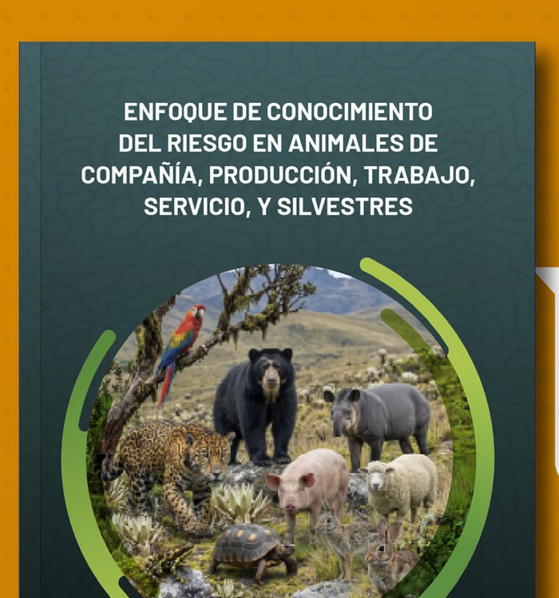</div>
        <div class="chapter-card-content">
          <span class="chapter-tag">Catálogo · Pág. 5</span>
          <h4 class="chapter-title">Enfoque de conocimiento del riesgo en animales de compañía, producción, trabajo, servicio y silvestres. Volumen 2</h4>
        </div>
      </div>

      <div class="chapter-card">
        <div class="chapter-card-image">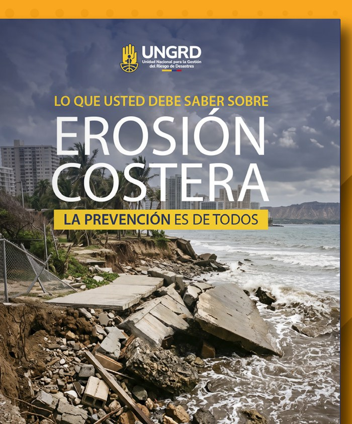</div>
        <div class="chapter-card-content">
          <span class="chapter-tag">Catálogo · Pág. 6</span>
          <h4 class="chapter-title">Boletín la prevención es de todos: Erosión Costera</h4>
        </div>
      </div>

      <div class="chapter-card">
        <div class="chapter-card-image">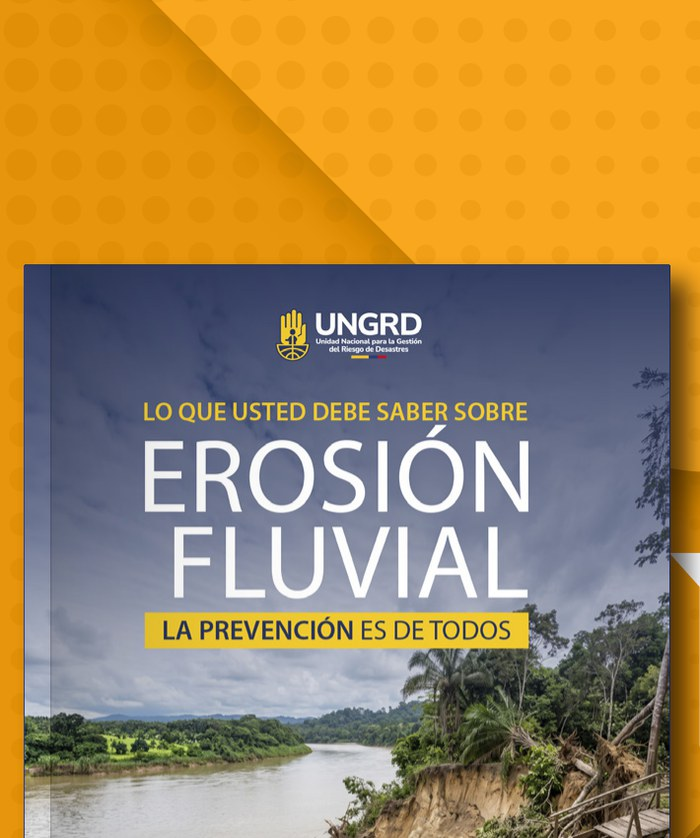</div>
        <div class="chapter-card-content">
          <span class="chapter-tag">Catálogo · Pág. 6</span>
          <h4 class="chapter-title">Boletín la prevención es de todos: Erosión fluvial</h4>
        </div>
      </div>

      <div class="chapter-card">
        <div class="chapter-card-image">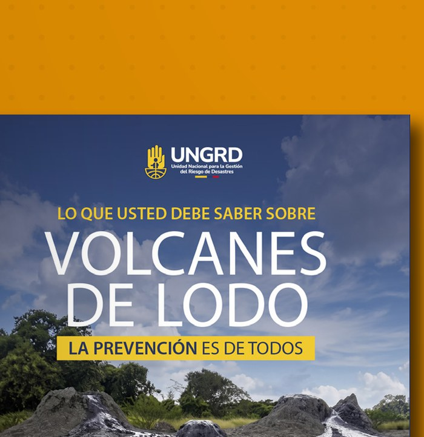</div>
        <div class="chapter-card-content">
          <span class="chapter-tag">Catálogo · Pág. 6</span>
          <h4 class="chapter-title">Boletín la prevención es de todos: Volcanes de lodo</h4>
        </div>
      </div>

      <div class="chapter-card">
        <div class="chapter-card-image">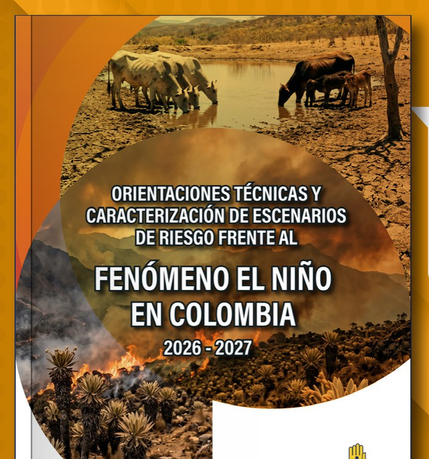</div>
        <div class="chapter-card-content">
          <span class="chapter-tag">Catálogo · Pág. 7</span>
          <h4 class="chapter-title">Orientaciones técnicas y caracterización de escenarios de riesgo frente al Fenómeno El Niño en Colombia 2026-2027</h4>
        </div>
      </div>

      <div class="chapter-card">
        <div class="chapter-card-image">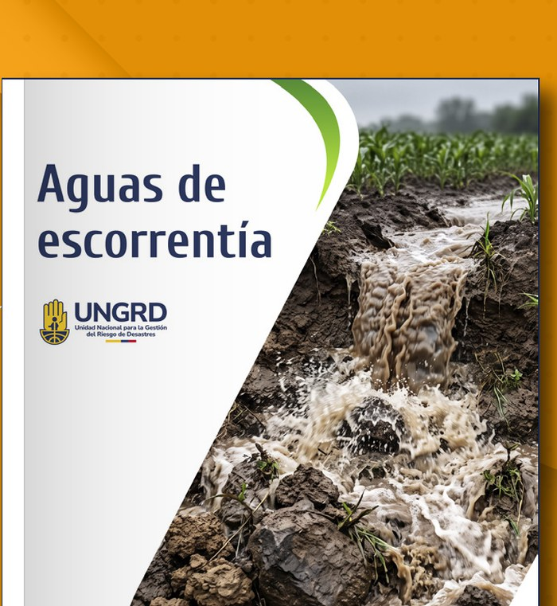</div>
        <div class="chapter-card-content">
          <span class="chapter-tag">Catálogo · Pág. 7</span>
          <h4 class="chapter-title">Cartilla: Conociendo el riesgo por aguas de escorrentía</h4>
        </div>
      </div>

      <div class="chapter-card">
        <div class="chapter-card-image">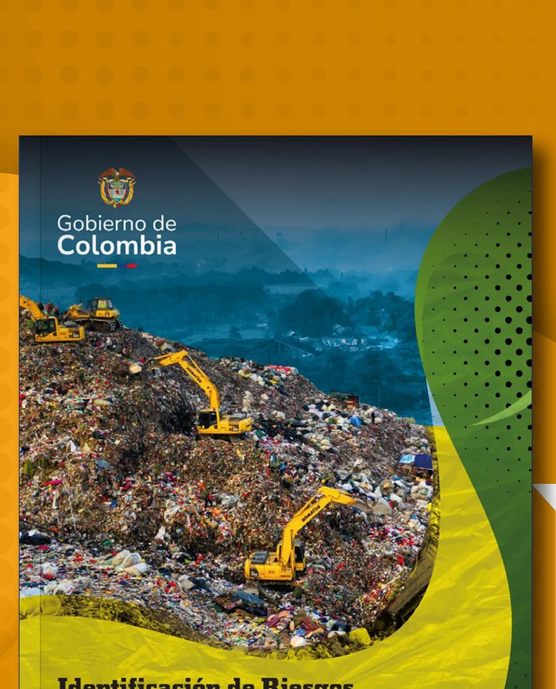</div>
        <div class="chapter-card-content">
          <span class="chapter-tag">Catálogo · Pág. 7</span>
          <h4 class="chapter-title">Marco teórico de riesgos alrededor de espacios destinados a la recolección, tratamiento y disposición final de residuos sólidos en el país</h4>
        </div>
      </div>

      <div class="chapter-card">
        <div class="chapter-card-image">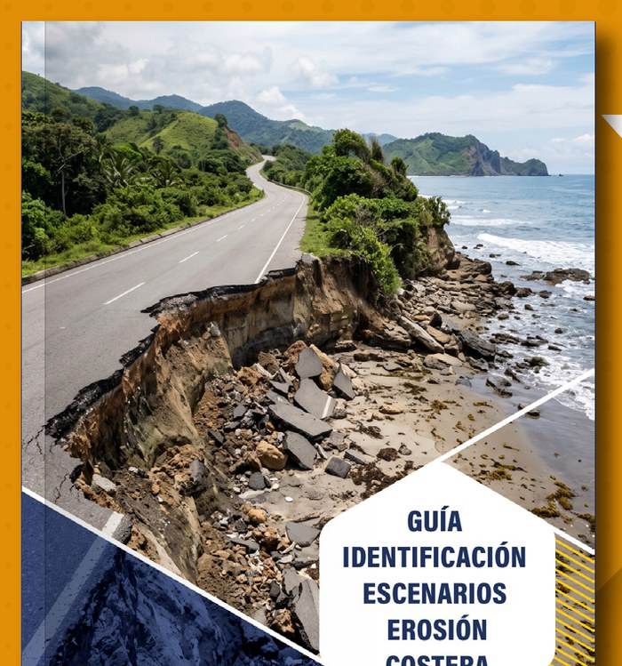</div>
        <div class="chapter-card-content">
          <span class="chapter-tag">Catálogo · Pág. 8</span>
          <h4 class="chapter-title">Guía identificación escenarios erosión costera</h4>
        </div>
      </div>

      <div class="chapter-card">
        <div class="chapter-card-image">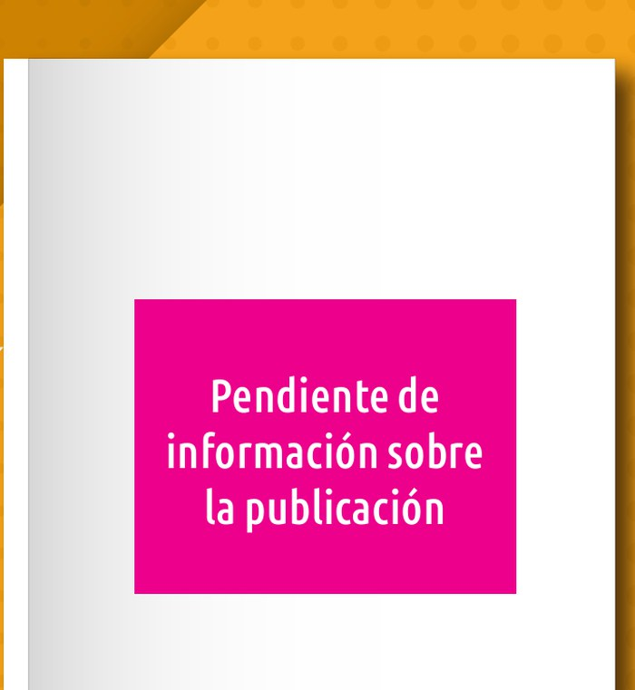</div>
        <div class="chapter-card-content">
          <span class="chapter-tag">Catálogo · Pág. 8</span>
          <h4 class="chapter-title">Caracterización de elementos expuestos (pendiente de publicación)</h4>
        </div>
      </div>

      <div class="chapter-card">
        <div class="chapter-card-image">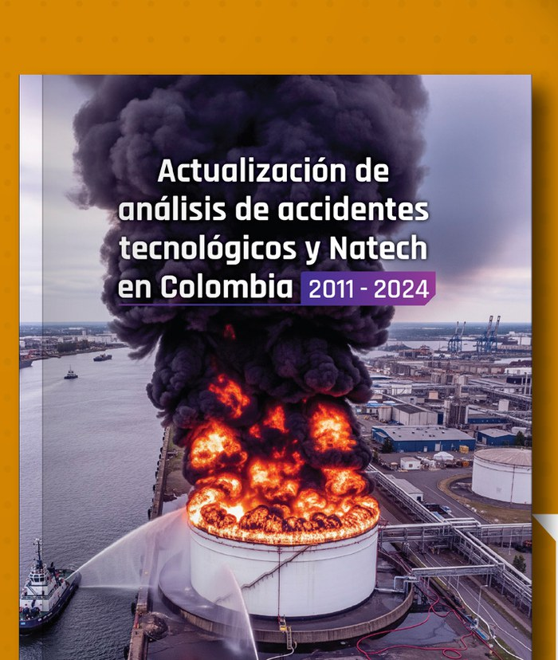</div>
        <div class="chapter-card-content">
          <span class="chapter-tag">Catálogo · Pág. 8</span>
          <h4 class="chapter-title">Libro: Actualización de análisis de accidentes tecnológicos y Natech en Colombia 2011–2024</h4>
        </div>
      </div>

      <div class="chapter-card">
        <div class="chapter-card-image"></div>
        <div class="chapter-card-content">
          <span class="chapter-tag">Catálogo · Pág. 9</span>
          <h4 class="chapter-title">Aplicación de los Sistemas de Información Geográfica (SIG) en la Gestión del Riesgo de Desastres</h4>
        </div>
      </div>

      <div class="chapter-card">
        <div class="chapter-card-image">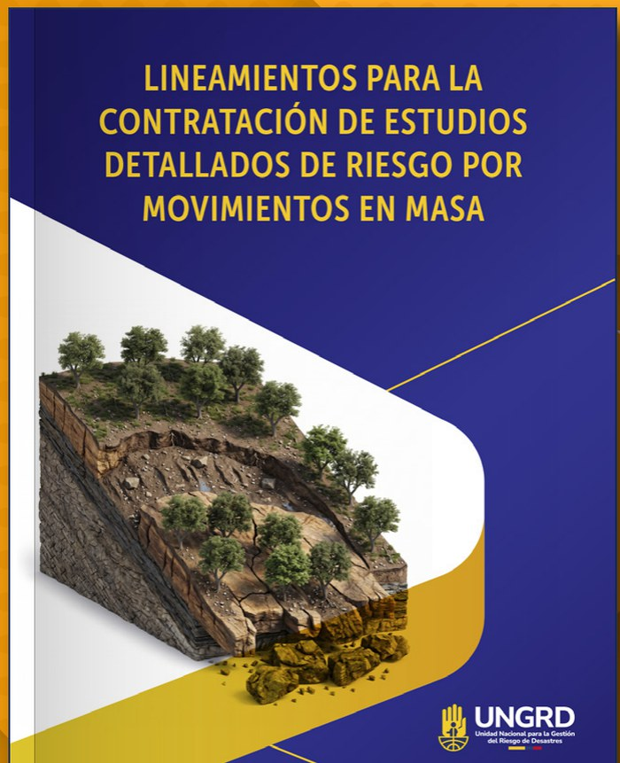</div>
        <div class="chapter-card-content">
          <span class="chapter-tag">Catálogo · Pág. 9</span>
          <h4 class="chapter-title">Lineamientos para la contratación de estudios detallados de riesgo por movimientos en masa</h4>
        </div>
      </div>

      <div class="chapter-card">
        <div class="chapter-card-image">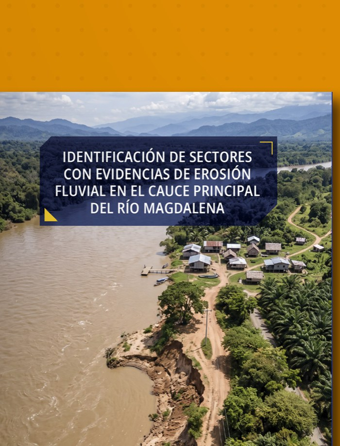</div>
        <div class="chapter-card-content">
          <span class="chapter-tag">Catálogo · Pág. 9</span>
          <h4 class="chapter-title">Identificación de sectores con evidencias de erosión fluvial en el cauce principal del Río Magdalena</h4>
        </div>
      </div>

      <div class="chapter-card">
        <div class="chapter-card-image">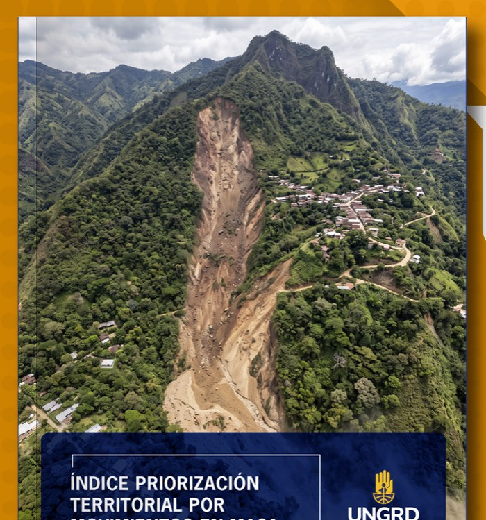</div>
        <div class="chapter-card-content">
          <span class="chapter-tag">Catálogo · Pág. 10</span>
          <h4 class="chapter-title">Índice priorización territorial por movimientos en masa</h4>
        </div>
      </div>

      <div class="chapter-card">
        <div class="chapter-card-image">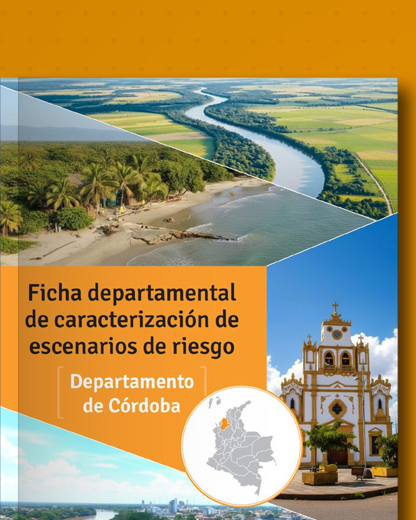</div>
        <div class="chapter-card-content">
          <span class="chapter-tag">Catálogo · Pág. 10</span>
          <h4 class="chapter-title">Fichas departamentales de caracterización de escenarios de riesgo</h4>
        </div>
      </div>

      <div class="chapter-card">
        <div class="chapter-card-image">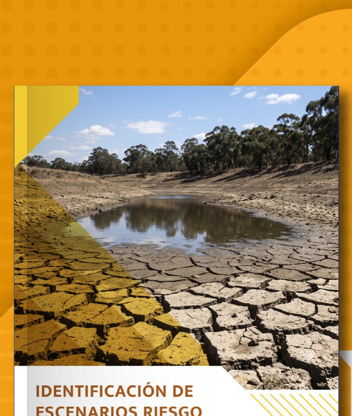</div>
        <div class="chapter-card-content">
          <span class="chapter-tag">Catálogo · Pág. 10</span>
          <h4 class="chapter-title">Identificación de Escenarios de Riesgo Nacional por Sequía</h4>
        </div>
      </div>

      <div class="chapter-card">
        <div class="chapter-card-image">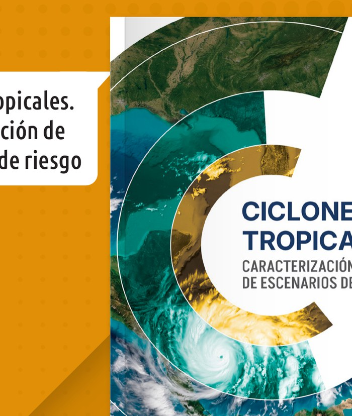</div>
        <div class="chapter-card-content">
          <span class="chapter-tag">Catálogo · Pág. 11</span>
          <h4 class="chapter-title">Ciclones tropicales. Caracterización de escenarios de riesgo</h4>
        </div>
      </div>

      <div class="chapter-card">
        <div class="chapter-card-image">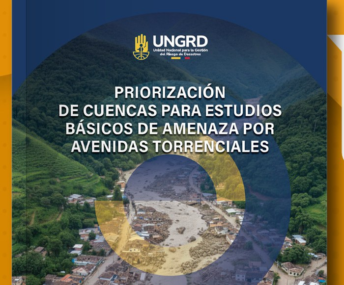</div>
        <div class="chapter-card-content">
          <span class="chapter-tag">Catálogo · Pág. 11</span>
          <h4 class="chapter-title">Libro y anexo: Priorización de cuencas para estudios básicos de amenaza por avenidas torrenciales</h4>
        </div>
      </div>

      <div class="chapter-card">
        <div class="chapter-card-image">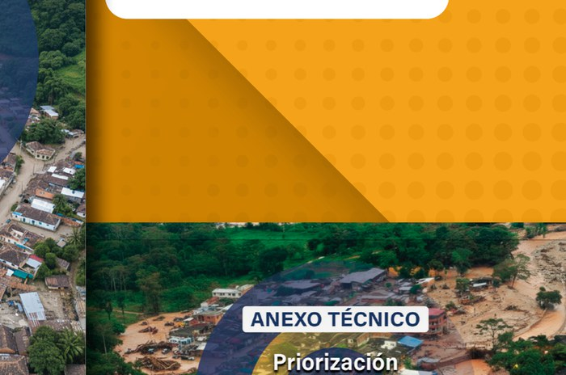</div>
        <div class="chapter-card-content">
          <span class="chapter-tag">Catálogo · Pág. 11</span>
          <h4 class="chapter-title">Anexo técnico: Priorización de cuencas para estudios básicos de amenaza por avenidas torrenciales</h4>
        </div>
      </div>

      <div class="chapter-card">
        <div class="chapter-card-image">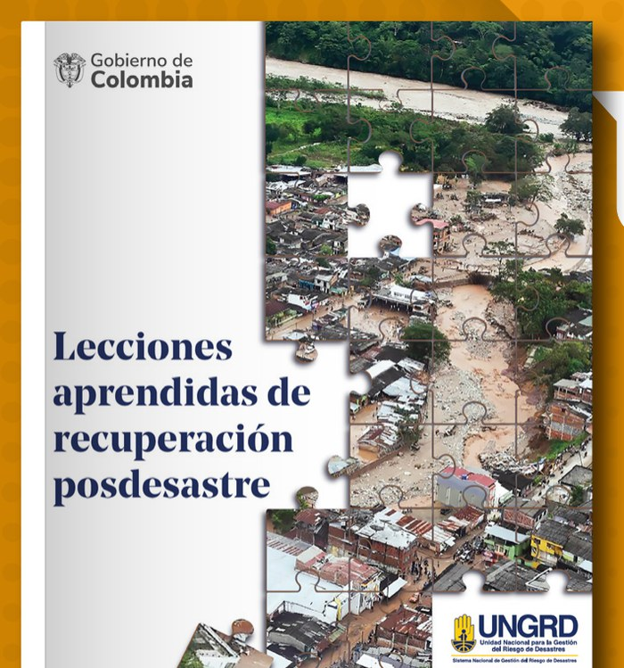</div>
        <div class="chapter-card-content">
          <span class="chapter-tag">Catálogo · Pág. 12</span>
          <h4 class="chapter-title">Lecciones aprendidas de recuperación posdesastre</h4>
        </div>
      </div>

      <div class="chapter-card">
        <div class="chapter-card-image">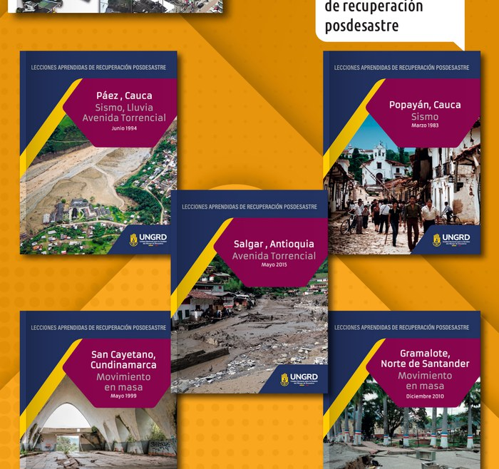</div>
        <div class="chapter-card-content">
          <span class="chapter-tag">Catálogo · Pág. 12</span>
          <h4 class="chapter-title">Cartillas: Lecciones aprendidas de recuperación posdesastre</h4>
        </div>
      </div>

      <div class="chapter-card">
        <div class="chapter-card-image">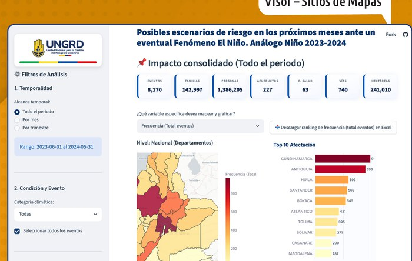</div>
        <div class="chapter-card-content">
          <span class="chapter-tag">Catálogo · Pág. 13</span>
          <h4 class="chapter-title">Visor – Sitios de Mapas</h4>
        </div>
      </div>
    </div>
  </div>
</section>

<!-- ══════════════════════════════════════════════════════
     2. ANÁLISIS Y EVALUACIÓN DEL RIESGO
     ══════════════════════════════════════════════════════ -->
<section id="analisis" class="chapters-section alt-bg topic-2">
  <div class="chapters-container">
    <div class="section-header">
      <span class="section-eyebrow">Línea temática 2</span>
      <h2 class="section-title">Análisis y evaluación del riesgo</h2>
      <div class="section-divider"></div>
      <p class="section-desc">
        Estudios y metodologías que analizan las posibles consecuencias de los
        escenarios de riesgo y estiman sus impactos sociales, económicos y
        ambientales, facilitando la toma de decisiones para reducir el riesgo.
      </p>
    </div>

    <div class="chapters-grid">
      <div class="chapter-card">
        <div class="chapter-card-image">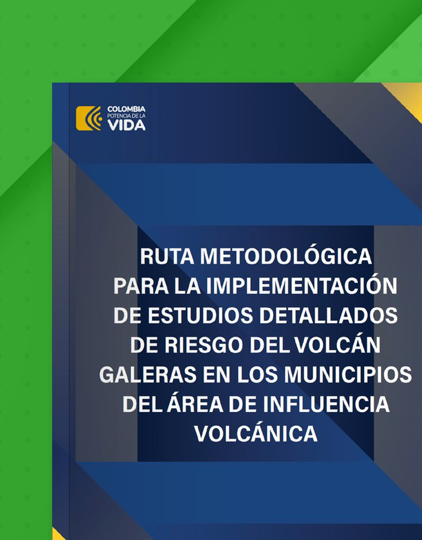</div>
        <div class="chapter-card-content">
          <span class="chapter-tag">Catálogo · Pág. 14</span>
          <h4 class="chapter-title">Informe: Ruta metodológica para la implementación de estudios detallados de riesgo del volcán Galeras en los municipios del área de influencia volcánica</h4>
        </div>
      </div>
    </div>
  </div>
</section>

<!-- ══════════════════════════════════════════════════════
     3. MONITOREO DEL RIESGO
     ══════════════════════════════════════════════════════ -->
<section id="monitoreo" class="chapters-section topic-3">
  <div class="chapters-container">
    <div class="section-header">
      <span class="section-eyebrow">Línea temática 3</span>
      <h2 class="section-title">Monitoreo del riesgo</h2>
      <div class="section-divider"></div>
      <p class="section-desc">
        Publicaciones relacionadas con el seguimiento de las amenazas y la evolución
        de las condiciones de riesgo, que fortalecen los sistemas de monitoreo y
        alerta y mantienen actualizado el conocimiento sobre los territorios.
      </p>
    </div>

    <div class="chapters-grid">
      <div class="chapter-card">
        <div class="chapter-card-image">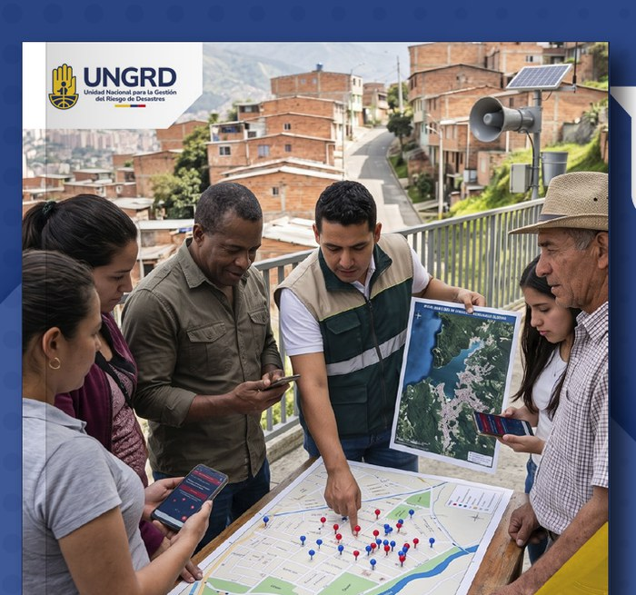</div>
        <div class="chapter-card-content">
          <span class="chapter-tag">Catálogo · Pág. 15</span>
          <h4 class="chapter-title">Diagnóstico de Sistemas de Alerta Temprana en Colombia</h4>
        </div>
      </div>

      <div class="chapter-card">
        <div class="chapter-card-image">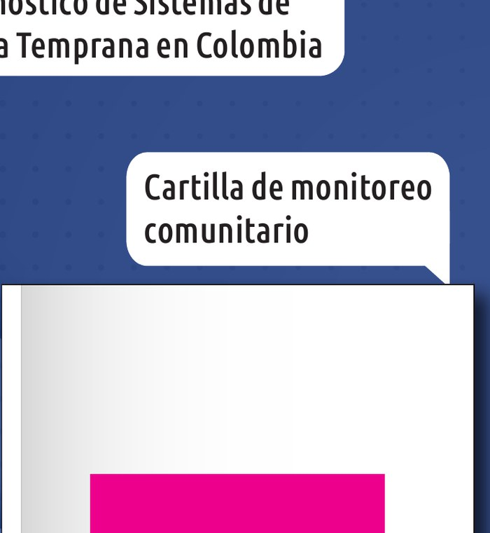</div>
        <div class="chapter-card-content">
          <span class="chapter-tag">Catálogo · Pág. 15</span>
          <h4 class="chapter-title">Cartilla de monitoreo comunitario (pendiente de publicación)</h4>
        </div>
      </div>

      <div class="chapter-card">
        <div class="chapter-card-image">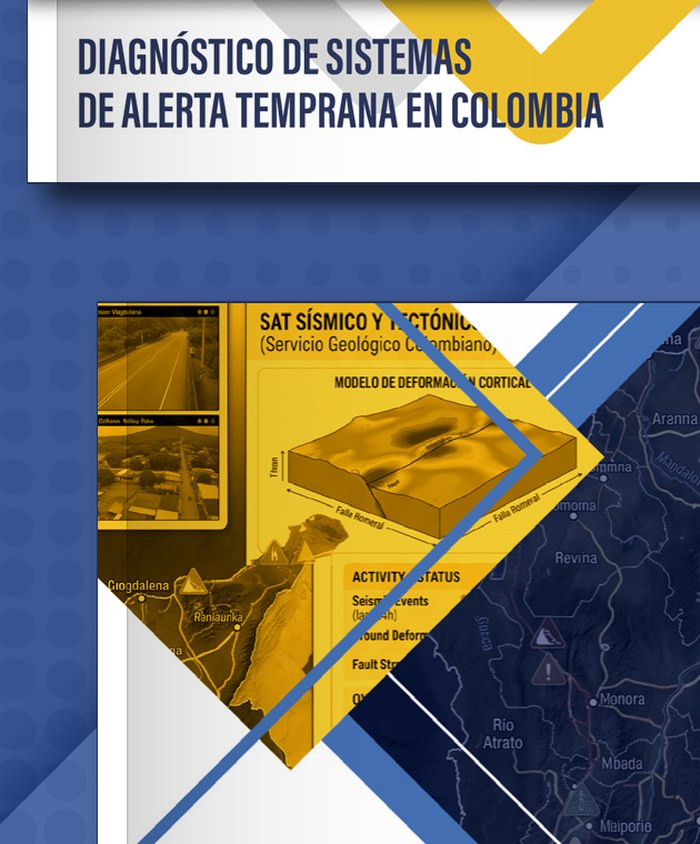</div>
        <div class="chapter-card-content">
          <span class="chapter-tag">Catálogo · Pág. 15</span>
          <h4 class="chapter-title">Sistematización de experiencias en Sistemas de Alerta Temprana Comunitarios</h4>
        </div>
      </div>

      <div class="chapter-card">
        <div class="chapter-card-image">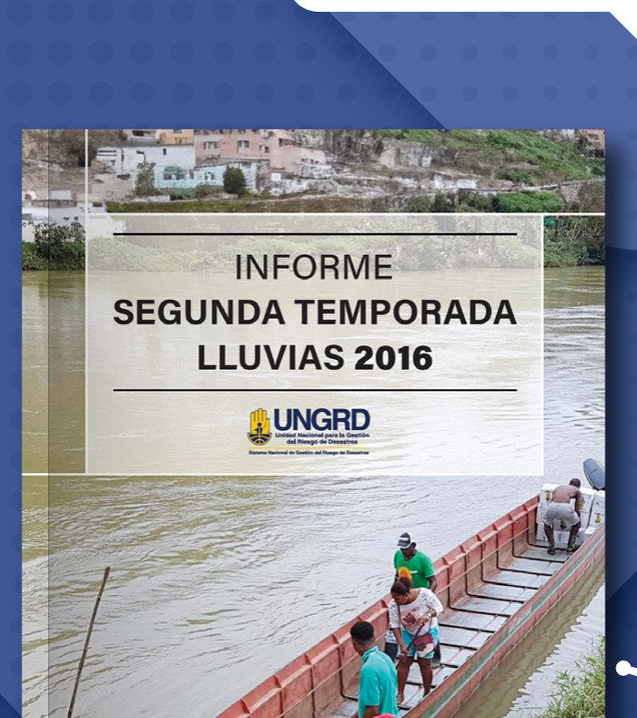</div>
        <div class="chapter-card-content">
          <span class="chapter-tag">Catálogo · Pág. 16</span>
          <h4 class="chapter-title">Informe Segunda Temporada Lluvias 2016</h4>
        </div>
      </div>

      <div class="chapter-card">
        <div class="chapter-card-image">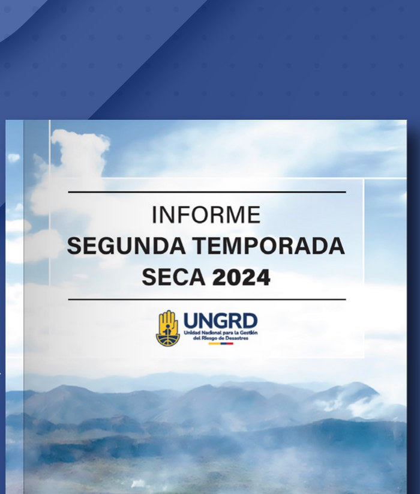</div>
        <div class="chapter-card-content">
          <span class="chapter-tag">Catálogo · Pág. 16</span>
          <h4 class="chapter-title">Informe Segunda Temporada Seca 2024</h4>
        </div>
      </div>
    </div>
  </div>
</section>

<!-- ══════════════════════════════════════════════════════
     4. COMUNICACIÓN DEL RIESGO
     ══════════════════════════════════════════════════════ -->
<section id="comunicacion" class="chapters-section alt-bg topic-4">
  <div class="chapters-container">
    <div class="section-header">
      <span class="section-eyebrow">Línea temática 4</span>
      <h2 class="section-title">Comunicación del riesgo</h2>
      <div class="section-divider"></div>
      <p class="section-desc">
        Materiales que promueven el diálogo entre el conocimiento técnico y la
        sociedad. A través de estrategias de comunicación, educación y apropiación
        social del conocimiento buscan fortalecer una cultura de prevención.
      </p>
    </div>

    <div class="chapters-grid">
      <div class="chapter-card">
        <div class="chapter-card-image">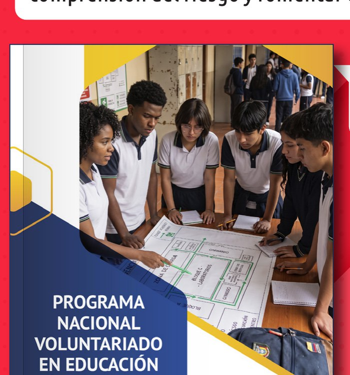</div>
        <div class="chapter-card-content">
          <span class="chapter-tag">Catálogo · Pág. 17</span>
          <h4 class="chapter-title">Programa Nacional Voluntariado en educación Básica y Media</h4>
        </div>
      </div>

      <div class="chapter-card">
        <div class="chapter-card-image">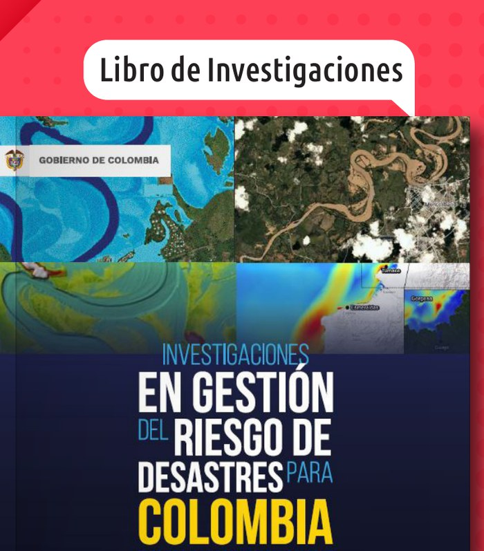</div>
        <div class="chapter-card-content">
          <span class="chapter-tag">Catálogo · Pág. 17</span>
          <h4 class="chapter-title">Libro de Investigaciones: Investigaciones en Gestión del Riesgo de Desastres para Colombia. Contribuciones locales, regionales y nacionales 2023</h4>
        </div>
      </div>

      <div class="chapter-card">
        <div class="chapter-card-image">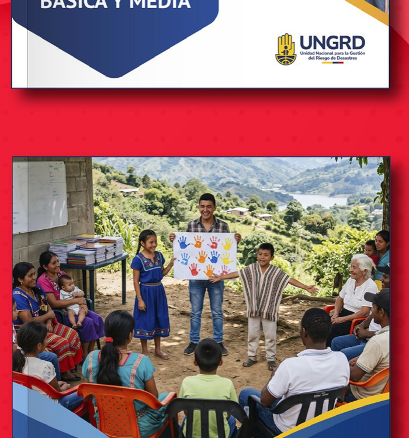</div>
        <div class="chapter-card-content">
          <span class="chapter-tag">Catálogo · Pág. 17</span>
          <h4 class="chapter-title">Programa de Educación Comunitaria</h4>
        </div>
      </div>

      <div class="chapter-card">
        <div class="chapter-card-image">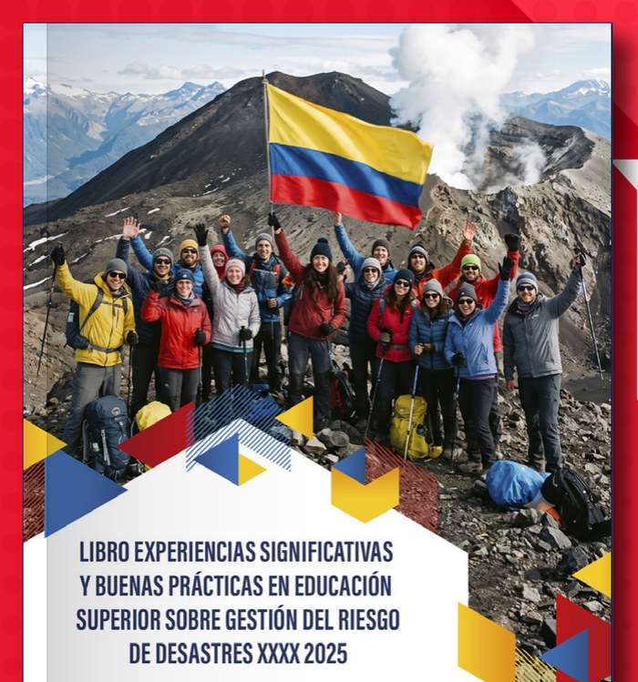</div>
        <div class="chapter-card-content">
          <span class="chapter-tag">Catálogo · Pág. 18</span>
          <h4 class="chapter-title">Libro experiencias significativas y buenas prácticas en educación superior sobre gestión del riesgo de desastres 2025</h4>
        </div>
      </div>

      <div class="chapter-card">
        <div class="chapter-card-image">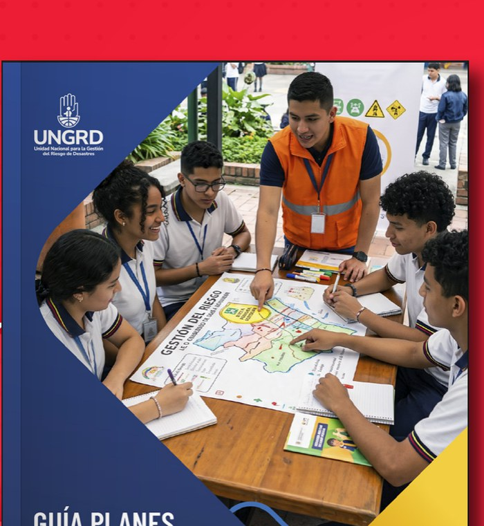</div>
        <div class="chapter-card-content">
          <span class="chapter-tag">Catálogo · Pág. 18</span>
          <h4 class="chapter-title">Guía Planes Territoriales en Gestión Integral del Riesgo escolar</h4>
        </div>
      </div>

      <div class="chapter-card">
        <div class="chapter-card-image">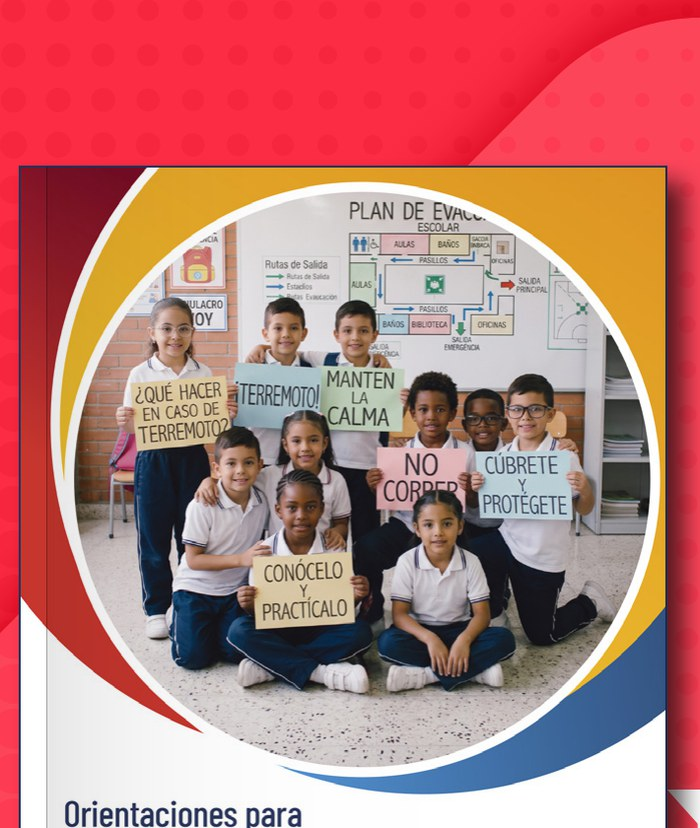</div>
        <div class="chapter-card-content">
          <span class="chapter-tag">Catálogo · Pág. 18</span>
          <h4 class="chapter-title">Orientaciones para la elaboración de los planes institucionales de gestión integral del riesgo escolar</h4>
        </div>
      </div>

      <div class="chapter-card">
        <div class="chapter-card-image">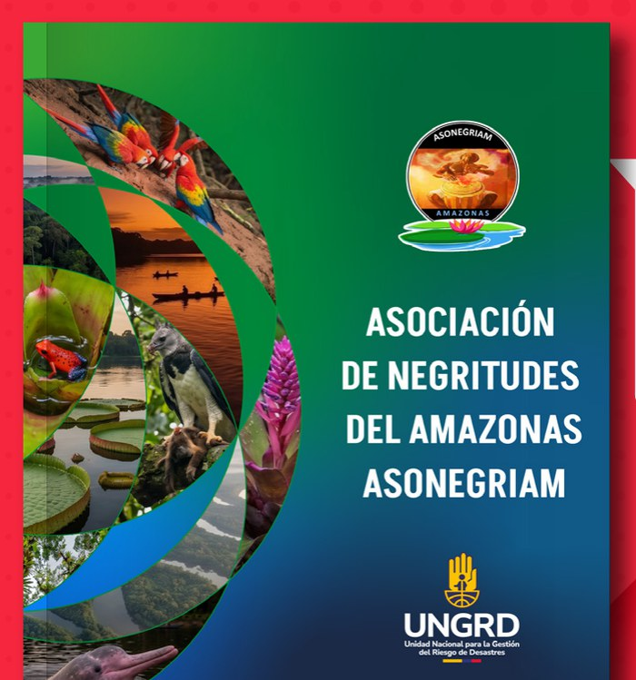</div>
        <div class="chapter-card-content">
          <span class="chapter-tag">Catálogo · Pág. 19</span>
          <h4 class="chapter-title">Asociación de Negritudes del Amazonas (ASONEGRIAM)</h4>
        </div>
      </div>

      <div class="chapter-card">
        <div class="chapter-card-image">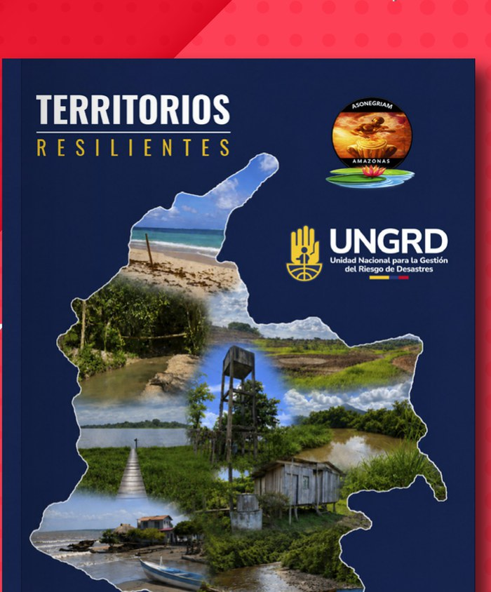</div>
        <div class="chapter-card-content">
          <span class="chapter-tag">Catálogo · Pág. 19</span>
          <h4 class="chapter-title">Territorios resilientes</h4>
        </div>
      </div>

      <div class="chapter-card">
        <div class="chapter-card-image">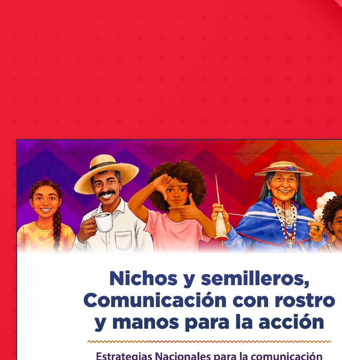</div>
        <div class="chapter-card-content">
          <span class="chapter-tag">Catálogo · Pág. 19</span>
          <h4 class="chapter-title">Estrategia Nacional de comunicación: Nichos y semilleros, comunicación con rostro y manos para la acción</h4>
        </div>
      </div>

      <div class="chapter-card">
        <div class="chapter-card-image">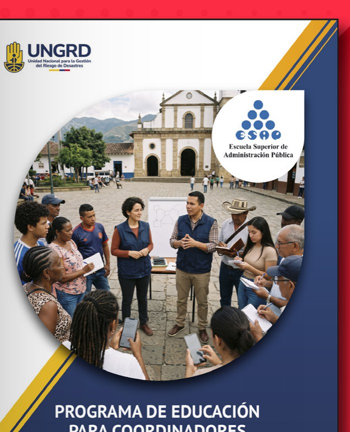</div>
        <div class="chapter-card-content">
          <span class="chapter-tag">Catálogo · Pág. 20</span>
          <h4 class="chapter-title">Programa de educación para coordinadores territoriales - ESAP</h4>
        </div>
      </div>

      <div class="chapter-card">
        <div class="chapter-card-image">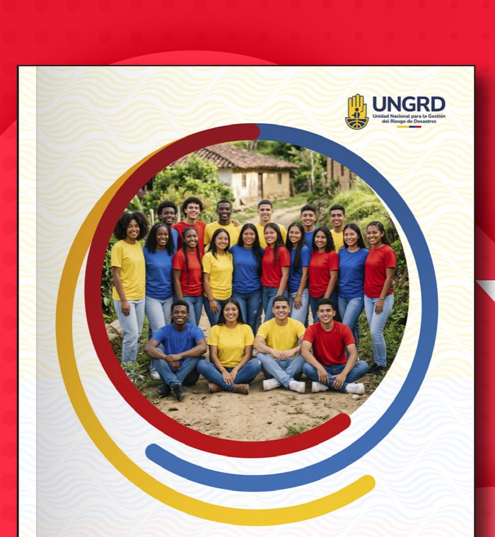</div>
        <div class="chapter-card-content">
          <span class="chapter-tag">Catálogo · Pág. 20</span>
          <h4 class="chapter-title">Programa Educativo del Servicio Social para la paz</h4>
        </div>
      </div>

      <div class="chapter-card">
        <div class="chapter-card-image">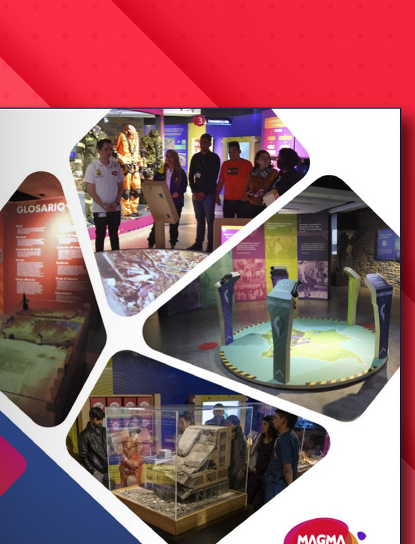</div>
        <div class="chapter-card-content">
          <span class="chapter-tag">Catálogo · Pág. 20</span>
          <h4 class="chapter-title">Programa Educativo MAGMA</h4>
        </div>
      </div>

      <div class="chapter-card">
        <div class="chapter-card-image">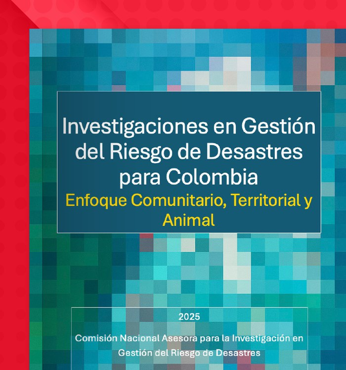</div>
        <div class="chapter-card-content">
          <span class="chapter-tag">Catálogo · Pág. 21</span>
          <h4 class="chapter-title">Libro: Investigaciones en Gestión del Riesgo de Desastres para Colombia. Enfoque Comunitario, Territorial y Animal</h4>
        </div>
      </div>

      <div class="chapter-card">
        <div class="chapter-card-image">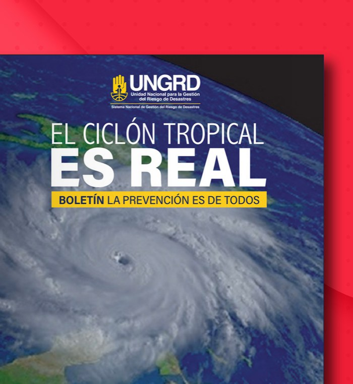</div>
        <div class="chapter-card-content">
          <span class="chapter-tag">Catálogo · Pág. 21</span>
          <h4 class="chapter-title">Boletín: La prevención es de todos | Ciclones Tropicales una Amenaza Estacional</h4>
        </div>
      </div>

      <div class="chapter-card">
        <div class="chapter-card-image">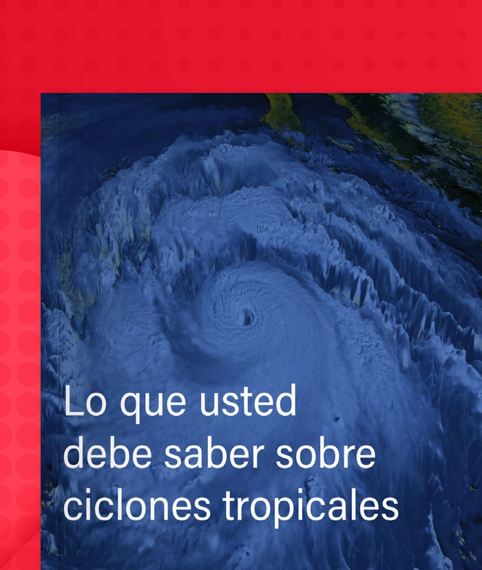</div>
        <div class="chapter-card-content">
          <span class="chapter-tag">Catálogo · Pág. 21</span>
          <h4 class="chapter-title">Cartilla: Lo que usted debe saber de Ciclones Tropicales</h4>
        </div>
      </div>

      <div class="chapter-card">
        <div class="chapter-card-image">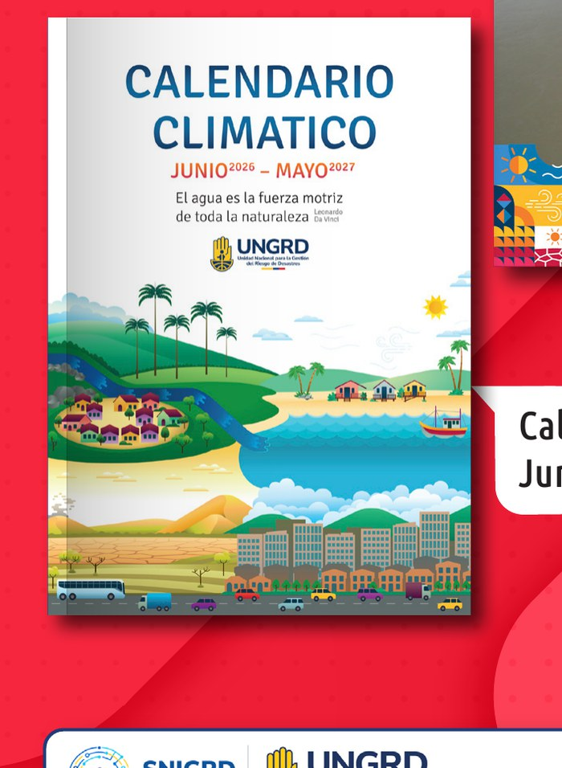</div>
        <div class="chapter-card-content">
          <span class="chapter-tag">Catálogo · Pág. 22</span>
          <h4 class="chapter-title">Calendario Climático Junio 2026 – Mayo 2027</h4>
        </div>
      </div>

      <div class="chapter-card">
        <div class="chapter-card-image">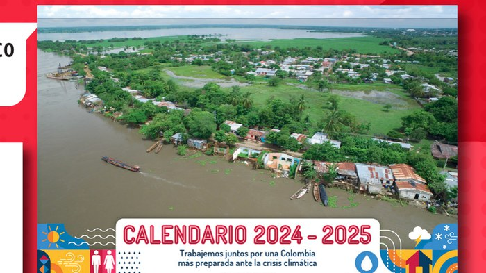</div>
        <div class="chapter-card-content">
          <span class="chapter-tag">Catálogo · Pág. 22</span>
          <h4 class="chapter-title">Calendario Climático 2024–2025</h4>
        </div>
      </div>

      <div class="chapter-card">
        <div class="chapter-card-image"></div>
        <div class="chapter-card-content">
          <span class="chapter-tag">Catálogo · Pág. 22</span>
          <h4 class="chapter-title">Visor de Fenómeno El Niño</h4>
        </div>
      </div>

      <div class="chapter-card">
        <div class="chapter-card-image">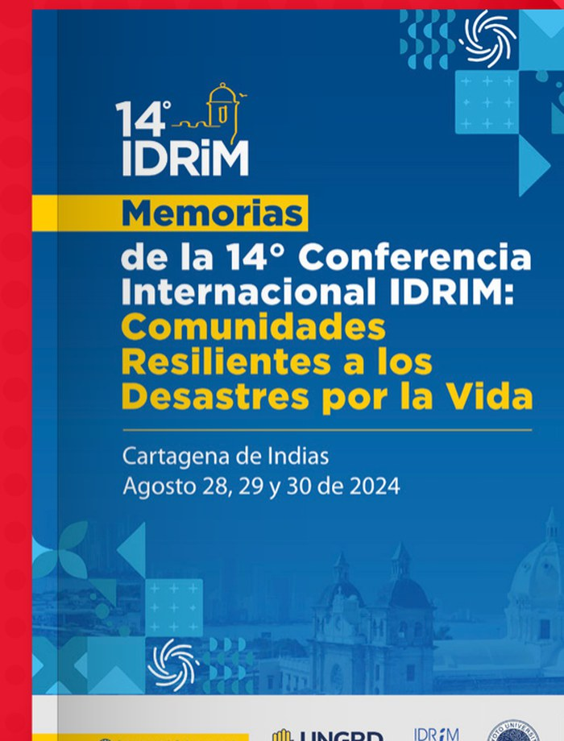</div>
        <div class="chapter-card-content">
          <span class="chapter-tag">Catálogo · Pág. 23</span>
          <h4 class="chapter-title">Libro de Memorias IDRiM 2024 (Español)</h4>
        </div>
      </div>

      <div class="chapter-card">
        <div class="chapter-card-image">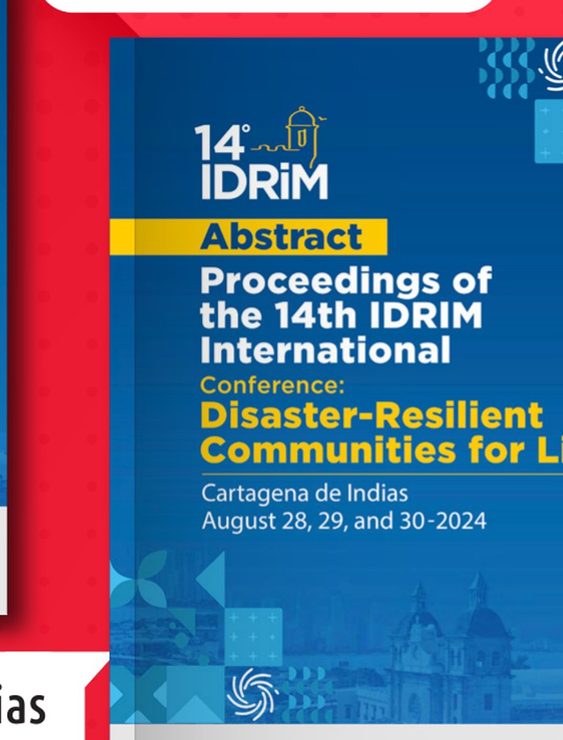</div>
        <div class="chapter-card-content">
          <span class="chapter-tag">Catálogo · Pág. 23</span>
          <h4 class="chapter-title">Libro de Memorias IDRiM 2024 (Inglés)</h4>
        </div>
      </div>

      <div class="chapter-card">
        <div class="chapter-card-image">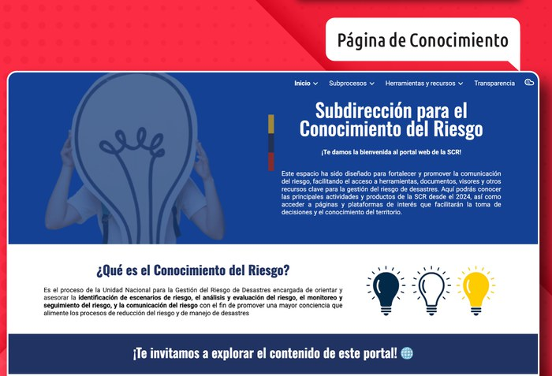</div>
        <div class="chapter-card-content">
          <span class="chapter-tag">Catálogo · Pág. 23</span>
          <h4 class="chapter-title">Página de Conocimiento</h4>
        </div>
      </div>

      <div class="chapter-card">
        <div class="chapter-card-image"></div>
        <div class="chapter-card-content">
          <span class="chapter-tag">Catálogo · Pág. 24</span>
          <h4 class="chapter-title">Podcast “Ni de Riesgos: Severo Desastre”</h4>
        </div>
      </div>

      <div class="chapter-card">
        <div class="chapter-card-image">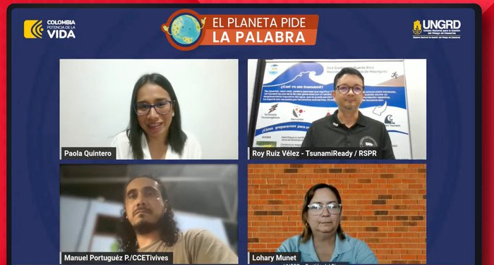</div>
        <div class="chapter-card-content">
          <span class="chapter-tag">Catálogo · Pág. 25</span>
          <h4 class="chapter-title">Webinar “El Planeta Pide la Palabra”</h4>
        </div>
      </div>
    </div>
  </div>
</section>

<!-- ══════════════════════════════════════════════════════
     CONTACTO
     ══════════════════════════════════════════════════════ -->
<section class="contact-section">
  <h2 class="section-title">Sistema Nacional para la Gestión del Riesgo de Desastres</h2>
  <p>
    Av. Calle 26 No. 92-32, Edificio Gold 4 - piso 2 · Bogotá D.C. - Colombia<br>
    Línea gratuita de atención: 01 8000 11 32 00 · PBX: (57) 601 552 9696<br>
    <a href="https://www.gestiondelriesgo.gov.co" target="_blank">www.gestiondelriesgo.gov.co</a>
  </p>
</section>
```
